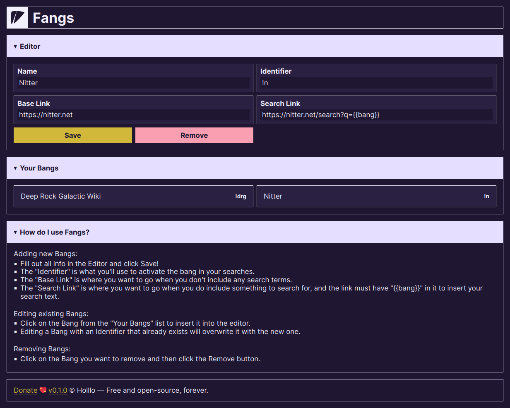

# Fangs

> Inject custom DuckDuckGo Bangs into your browsing experience.

[](https://addons.mozilla.org/firefox/addon/holllo-fangs)



## Installation

You can install Fangs through [Mozilla Addons], [installing from a file] (see [the Releases page] for a prebuilt version) or building [from source](#development).

[installing from a file]: https://support.mozilla.org/en-US/kb/find-and-install-add-ons-add-features-to-firefox#w_how-do-i-find-and-install-add-ons
[Mozilla Addons]: https://addons.mozilla.org/firefox/addon/holllo-fangs/
[the Releases page]: https://github.com/Holllo/fangs/releases

## Development

To build Fangs you will need [git], [NodeJS] and [pnpm]. Then from a terminal, run the following commands.

[git]: https://git-scm.com
[NodeJS]: https://nodejs.org
[pnpm]: https://pnpm.io

```sh
# Step 1. Download the repository with Git.
git clone https://github.com/Holllo/fangs
cd fangs

# Step 2. Install the dependencies.
pnpm install

# Step 3. Start an auto-reloading browser instance for development.
pnpm start

# Step 4. Lint the code and run tests.
pnpm test

# Step 5. Build the WebExtension for production.
# See the web-ext-artifacts directory for output.
pnpm build
```

## License

Fangs is open-sourced with the [GPL-3.0-or-later] license.

[GPL-3.0-or-later]: https://github.com/Holllo/fangs/blob/main/LICENSE
